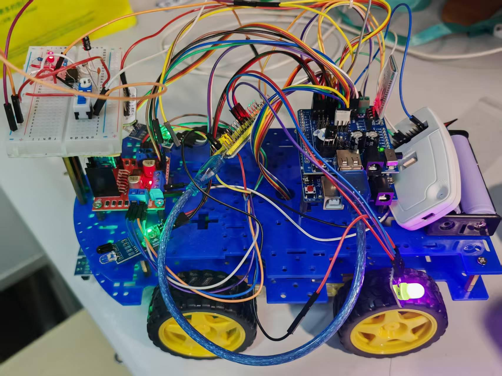
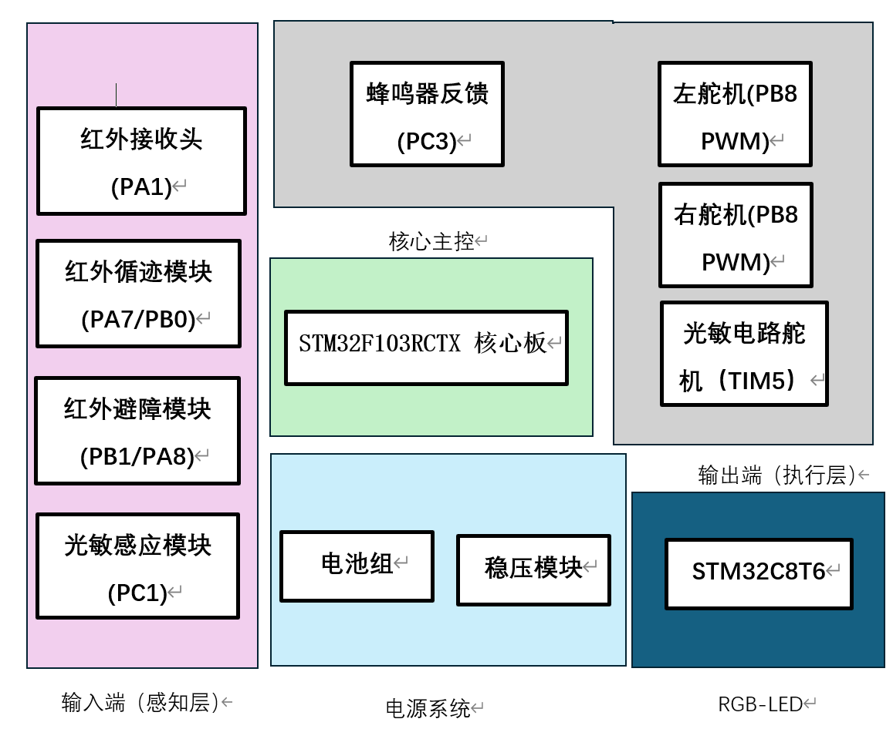
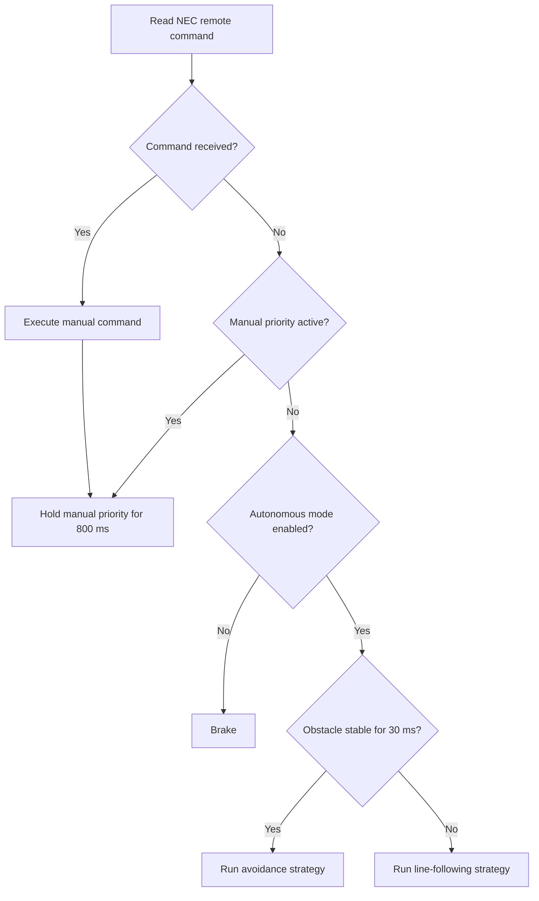

# STM32 Infrared Smart Car

An STM32F103-based mobile robot that combines infrared remote control, line following, obstacle avoidance, ambient-light-aware speed control, and a servo-mounted sensor platform.



## Highlights

- Dual-channel infrared line following with differential steering
- Dual-channel infrared obstacle detection with debouncing and escape manoeuvres
- NEC infrared remote decoding through a dual-edge EXTI interrupt
- Manual-control priority window to prevent autonomous logic from overriding remote commands
- TIM4 PWM motor drive with signed speed commands from `-100` to `100`
- Light-sensitive speed switching: 60% in normal light and 40% when the dark-state input is active
- TIM5 50 Hz servo positioning, initialized to 90 degrees
- Independent STM32F103C8T6 indicator-board firmware with a three-step LED sequence
- Regenerable STM32CubeMX projects and ready-to-open Keil MDK project files

## System overview



The main loop gives control sources a deliberate priority:



## Hardware

The primary controller targets an STM32F103RC (LQFP64). The auxiliary indicator board targets an STM32F103C8 (LQFP48).

| Function | Main-controller pin / peripheral |
| --- | --- |
| NEC infrared receiver | PA1 / EXTI1 |
| Left line sensor | PB0 |
| Right line sensor | PA7 |
| Left obstacle sensor | PA8 |
| Right obstacle sensor | PB1 |
| Ambient-light digital input | PC1 |
| Left motor PWM | PB8 / TIM4_CH3 |
| Right motor PWM | PB9 / TIM4_CH4 |
| Left motor direction | PB7 |
| Right motor direction | PA4 |
| Servo PWM | PA0 / TIM5_CH1 |
| Debug / optional serial link | PA9, PA10 / USART1 at 9600 baud |

The sensor polarity and action tables are documented in [Hardware and control notes](docs/hardware-and-control.md).

## Repository layout

```text
.
├── firmware/
│   ├── main-controller/     # Robot control firmware (STM32F103RC)
│   │   ├── Core/            # Application, BSP modules, interrupts
│   │   ├── Drivers/         # STM32 HAL and CMSIS
│   │   ├── MDK-ARM/         # Keil project and startup file
│   │   └── smart-car-main.ioc
│   └── indicator-board/     # Auxiliary three-LED sequence (STM32F103C8)
│       ├── Core/
│       ├── Drivers/
│       ├── MDK-ARM/
│       └── indicator-board.ioc
└── docs/
    ├── hardware-and-control.md
    └── images/
```

## Build and flash

### Keil MDK

1. Install Keil MDK-ARM and the STM32F1 device pack.
2. Open `firmware/main-controller/MDK-ARM/CAR_1.uvprojx`.
3. Build the `CAR_1` target and flash it with ST-Link.
4. If the auxiliary board is used, open `firmware/indicator-board/MDK-ARM/CAR_2.uvprojx` and build it separately.

The archived main-controller build completed with Arm Compiler 5.06 update 7 using 11,198 bytes of code and reported zero errors and zero warnings. Generated binaries and machine-specific build logs are intentionally excluded from version control.

### STM32CubeMX

Open either `.ioc` file to inspect or regenerate peripheral initialization. Preserve code inside CubeMX `USER CODE` sections when regenerating.

## Firmware modules

| Module | Responsibility |
| --- | --- |
| `main.c` | Initialization, mode state, remote-control priority, obstacle debounce, scheduling |
| `motor.c` | PWM initialization, signed motor speed mapping, motion primitives |
| `IRSEARCH.c` | Line sensor decisions and light-aware tracking speed |
| `IRAvoid.c` | Directional avoidance and blocked-path escape sequence |
| `remote.c` | NEC timing decode and key-value delivery |
| `keysacn.c` | Startup key scan, buzzer and indicator interaction |
| `servo.c` | Servo angle limiting and TIM5 compare mapping |

## Notes

- Tune the line and obstacle sensor potentiometers for the surface and lighting conditions before testing.
- Raise the chassis so the wheels are clear of the table during the first motor-direction test.
- The current avoidance and line-following routines are mutually exclusive during an avoidance manoeuvre; reacquiring the line after a large detour is a useful future improvement.
- The original academic report is not included because it contains personal and institutional identifiers. Its technical content was used to prepare this documentation.

## License

Original project code and documentation are released under the [MIT License](LICENSE). Bundled STM32 HAL and CMSIS components retain their upstream licenses; see [Third-party notices](THIRD_PARTY_NOTICES.md).
